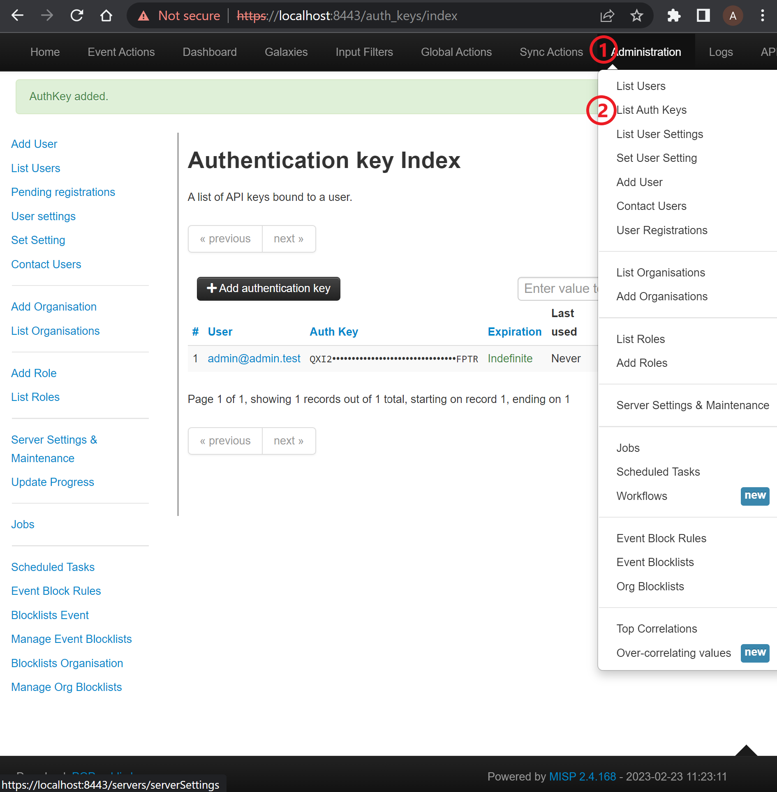
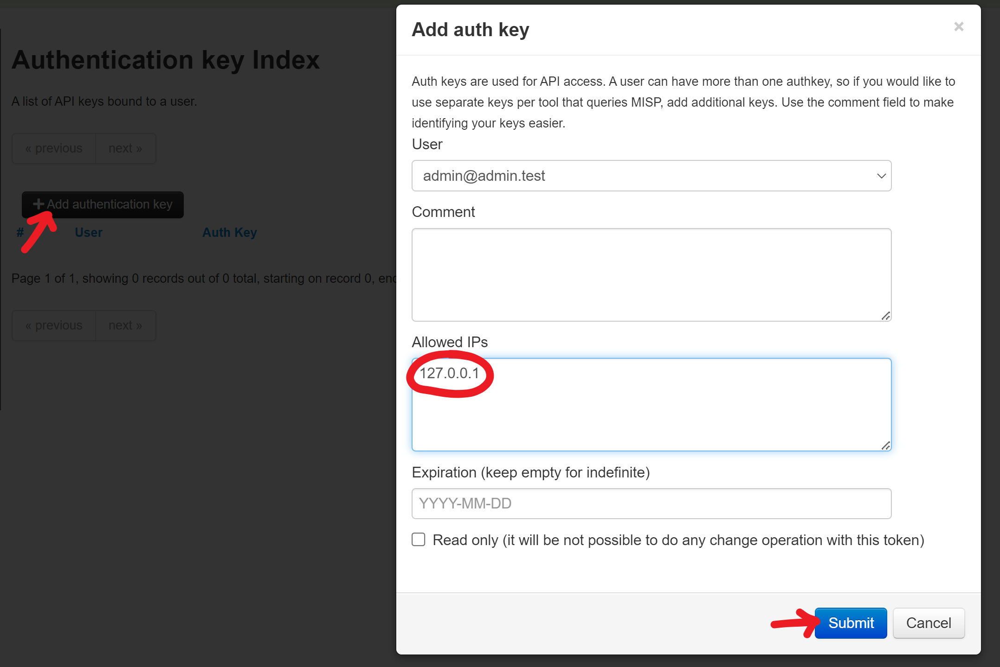

Check the screenshot below.

# Steps

1. Log into MISP
2. Click on "Administration" dropdown and select "List Auth Keys"
3. Click on "add Authentication key"
4. Fill the form ("Allowed IPs" is mandatory)
5. Submit
6. **Copy somewhere the api key. There isn't a way to take it later**

# Screenshots

- Steps `1`, `2`
  

- Steps `3`, `4`, `5`
  